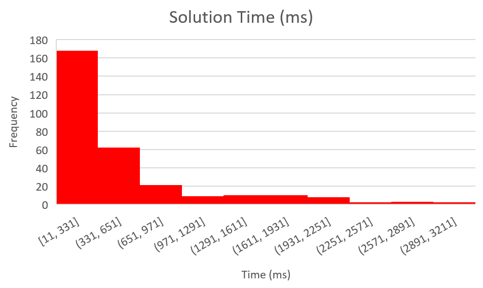

# Rubik Cube Solver

This is an implementation of Thistlewaite's solving algorithm using pattern databases and Iterative Deepening A* (IDA*) pathfinding, made in C++ and OpenGL. It outputs both a sequence of moves and a 3D visualization of the solution. Any scrambled cube is solved in 45 moves or less, and takes 0.6 seconds to generate on average. 

## Demonstration
<br />
A solution to a random 5-move scramble.

<br />
Scrambles and solutions output.

## How it works
An intuitive, brute-force approach to solving a Rubik's Cube is to apply all possible combinations of moves until a solution is obtained. Since there are 43 quintillion possible scrambled states, modern computers have neither the necessary memory nor time to reach a solution using this approach. [Thistlethwaite](https://www.jaapsch.net/puzzles/thistle.htm) suggests that a scrambled cube can be solved in 4 phases. Upon completing each phase, the cube is moved into a progressively solved position where only a subset of the original 18 moves is needed to advance to the next phase. Since solving each phase is guaranteed to take a small number of moves, a memory intensive search between each phase becomes feasible.

### Phase 1
A scrambled cube is considered Phase 0. To reach Phase 1, all edges must be brought into their correct orientations. Here, a "correct orientation" is defined as an edge that can be solved only by rotating right, left, up, or down faces. All 18 moves are allowed, but edge orientations are only affected by 90° turns of the front and back faces so ```F```, ```F'```, ```B```, and ```B'``` moves are restricted upon reaching this phase. Another way to think about it is that states in Phase 1 can be solved using only 90° turns of the front and back faces.

### Phase 2
Now that all edge orientations are fixed, corners are brought into their correct orientations and E-slice edges are brought into their correct slice using the remaining 14 allowed moves. Corner orientations and E-slice edge permutations are only affected by 90° turns of the right and left phases. Hence, phase 2 states can be solved using only ```R```, ```R'```, ```L```, and ```L'``` moves, and these moves are no longer allowed to be used to solve Phase 3 states.

### Phase 3
Next, all corners are moved into the correct orbits. ```U```, ```U'```, ```D```, and ```D'``` moves are restricted, all edges are correctly oriented and in their correct permutations, and all corners are correctly oriented and in their correct orbits. This leaves only 180° turns to bring the corners into correct permutations and reach Phase 4 (solved state).

Here is a summary of each phase:

| Phase       |            # Possible States          | # Max Moves Until Reached | Branching Factor |
| :---------: | :-----------------------------------: | :-----------------------: | :--------------: |
|      1      |  $2^{11} = 2048 $                     |              7            |        18        |
|      2      |  $3^7 \times \binom{12}{4} = 1082565$ |              10           |        14        |
|      3      |  $8! \times \binom{8}{4} = 2822400$   |              13           |        10        |
|      4      |  $96 \times \frac{4!^3}{2} = 663552$  |              15           |        6         |

Adding up the # moves column, we see that the total maximum number of moves to solve a cube is 45.

### IDA*
Although BFS can be used to find the path from one group to the next, it is slow. A* search is considerably faster because it is informed by a heuristic. It is capable of knowing whether applying a move brings it closer to the solution, and it does this by minimizing the "cost" of its path. The heuristic in this case is the number of moves away from the next phase. IDA* is a version of iterative deepening depth-first search that uses heuristics like A*, but saves memory because it only keeps track of nodes on its current path. Unlike A*, IDA* can potentially re-explore the same nodes, but the sheer number of states at each phase means re-exploration is unlikely for this purpose.

### Pattern Databases
Here, IDA* is used to find the shortest path from one phase to the next, using pattern databases with pre-computed distances as a heuristic. The database stores all possible states for a particular phase as well as the number of moves it is away from a solved state. For example, generating the Phase 0 database would involve iteratively applying the 18 allowed moves to a solved cube, creating a unique id for their respective edge orientation states, and recording their ids as being 1 move away from Phase 1. This process continues until all 2048 possible edge orientation combinations with their respective distances are recorded in the database. Here, a BFS is used to generate the databases and data is stored in .bin files for quick reading and writing. To use the table, one would calculate and look up the current id of the scrambled cube for its associated distance.

## Statistics
The following graphs were made from 300 data points with 5 outliers removed. Each trial applied a random 20-move scramble to a solved cube prior to measuring solving stats. A log transformation was applied to the right-skewed solution time data points to normalize it. The mean solving time is 650.84 milliseconds, the mean number of moves is 31.26, and the maximum number of moves is 37. This is under the calculated maximum number of moves of 45.

 


## How to compile
This project was developed and tested for Linux and Windows. The Makefile will detect which operating system you are using and adjust the compilation instructions accordingly. You will also need to download [stb_image.h](https://github.com/nothings/stb/blob/master/stb_image.h) and move it into the project directory.

### Linux
To install required dependencies, open a terminal in the project directory and run:
```
sudo apt-get update
bash install.sh
```
Next, run ``` make ``` to create an executable.

### Windows
MSYS2 and MinGW are needed to install dependencies. You can install it [here](https://www.msys2.org/) if you don't already have it.

Launch ```MSYS MinGW 64-bit``` from the ```Start``` window, and run:
```
  pacman -S mingw-w64-x86_64-glew
  pacman -S mingw-w64-x86_64-glfw
  pacman -S mingw-w64-x86_64-glm
```
In the project directory, run ```make``` to compile into an executable.

## Controls
To manually twist the faces of the cube, use ```F```, ```B```, ```R```, ```L```, ```U```, and ```D``` for 90° counter-clockwise turns. Hold ```SHIFT``` while pressing the keys for 90° clockwise turns. Hold ```2``` for 180° clockwise turns.

Rotate the whole cube using ```↑```, ```→```, ```↓```, and ```←```.

Press ```ENTER``` to apply a random 5-move scramble.

Press ```SPACE``` to solve.

You can press ```ENTER``` and ```SPACE``` again to stop scrambling or solving respectively.

Click [here](https://jperm.net/3x3/moves) to learn more about moves used to solve Rubik cubes.

## Links
[Details on indexing and states](http://joren.ralphdesign.nl/projects/rubiks_cube/cube.pdf)

[Inspiration for this project](https://github.com/dfinnis/Rubik)

[Inspiration for visualizer](https://iamthecu.be/)

[Overview of computer cubing](https://www.jaapsch.net/puzzles/compcube.htm)
